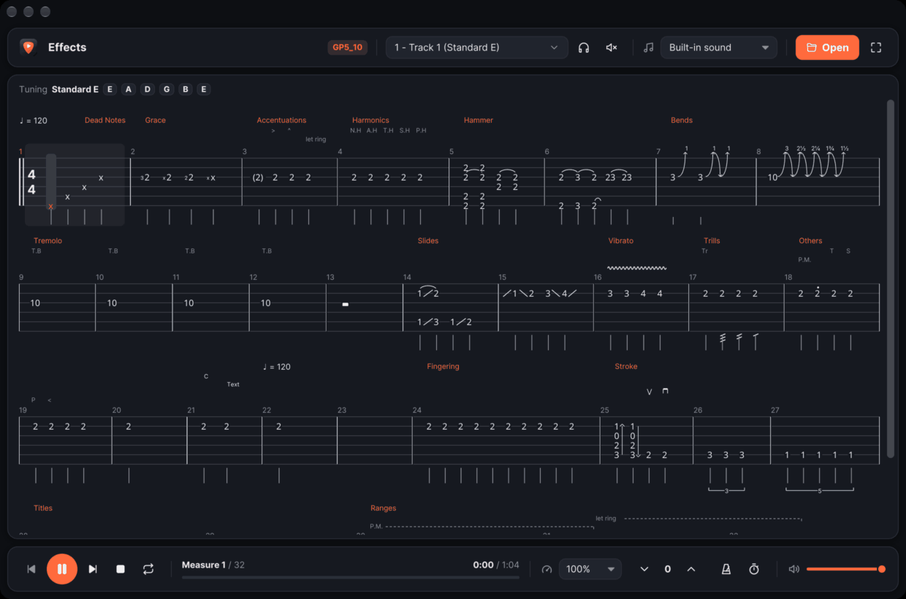

# MacGuitar

[](https://github.com/Gabr55/macguitar/actions/workflows/ci.yml)

A Guitar Pro tablature player for macOS.

Based on [ruxguitar](https://github.com/agourlay/ruxguitar) by Arnaud Gourlay, under the Apache License 2.0. Its original design is described in the article "[Playing guitar tablatures in Rust](https://agourlay.github.io/ruxguitar-tablature-player/)".



## Features

- Guitar Pro files: GP3, GP4, GP5, GP6 (`.gpx`) and GP7 (`.gp`)
- Tablature drawn after scores: palm mute, let ring and vibrato over the beats they last, slurs and slides, bends and whammy bar, tuplets, rests, chords, repeats and alternative endings, the tempo as written
- MIDI playback with the embedded SoundFont, or any `.sf2` picked in the app; repeats, alternative endings and jumps (D.C., D.S., To Coda, Fine) are followed as Guitar Pro plays them, tempo changes included
- Tracks: selection, solo, mute and volume for each, the tuning shown above the tablature
- Practice:
    - loops: drag over measures with the right mouse button, right click a loop to clear it, or press `L` to loop the current measure
    - tempo from 25% to 200%
    - retune the whole song by semitones (an octave either way) to play along in another tuning with the same frets
    - metronome and count-in
- Recent files, on the welcome screen and in the header
- Light and dark themes following the system
- Keyboard shortcuts:
    - `Space` play/pause
    - `Left` / `Right` previous/next measure
    - `Ctrl+Up` / `Ctrl+Down` tempo up/down
    - `L` toggle the loop
    - `S` / `M` solo / mute the track
    - `Ctrl+Cmd+F` (or `F11`) fullscreen, `Esc` to leave it
- A left click places the playhead on a beat
- Files open from the dialog, the recent files, or by drag and drop

It is a player: no editing, and tablature only, no standard notation.

## Installation

### macOS (Apple Silicon)

Download `MacGuitar-<version>-macos-arm64.zip` from the [releases](https://github.com/Gabr55/macguitar/releases), unzip it and move `MacGuitar.app` to Applications, or run the install script, which does that with the latest release:

```bash
curl -fsSL https://raw.githubusercontent.com/Gabr55/macguitar/master/scripts/install.sh | sh
```

The app is signed ad hoc, not notarized by Apple.

### Windows (64-bit)

Download `MacGuitar-<version>-windows-x64.zip` from the [releases](https://github.com/Gabr55/macguitar/releases), unzip it and run `MacGuitar.exe` (Windows 10 or later). The exe is not signed: SmartScreen asks to confirm the first launch ("More info", then "Run anyway").

### Other systems, from source

The player builds on macOS (Intel included) and Linux as well; the dependencies each system needs are in the [CI configuration](https://github.com/Gabr55/macguitar/blob/master/.github/workflows/ci.yml).

```bash
cargo install --locked --git https://github.com/Gabr55/macguitar
```

## Sound

A small SoundFont is embedded for a plug and play experience; a larger one sounds much better. Pick one from the sound menu in the header: the choice is remembered. SoundFonts placed in `~/.config/macguitar/soundfonts/` are listed there. [GeneralUser GS](https://github.com/mrbumpy409/GeneralUser-GS) is a good one, small (32 MB) and well balanced; `FluidR3_GM.sf2` is another, present on many Linux systems.

## Command line

The app needs none, but accepts:

```
Usage: macguitar [OPTIONS]

Options:
      --sound-font-file <SOUND_FONT_FILE>  Optional path to a sound font file
      --tab-file-path <TAB_FILE_PATH>      Optional path to tab file to by-pass the file picker
      --no-antialiasing                    Disable antialiasing
      --theme <THEME>                      Force the color theme [possible values: light, dark]
  -h, --help                               Print help
  -V, --version                            Print version
```

Settings are kept in `~/.config/macguitar/`. On the first launch, those of ruxguitar, in `~/.config/ruxguitar/`, are moved there.

## FAQ

- **Where can I find Guitar Pro files?**
  - Many sites share them, [Ultimate Guitar](https://www.ultimate-guitar.com/) for instance.

- **Why are the strings not drawn?**
  - Some graphics drivers need antialiasing off: `--no-antialiasing`.

- **Why does the theme not follow my Linux desktop?**
  - The windowing layer reports no preference on Linux, so the dark theme is kept. `--theme light` or `--theme dark` picks one.

- **Why is the file picker not opening on Linux?**
  - Install the `XDG Desktop Portal` package of your [desktop environment](https://wiki.archlinux.org/title/XDG_Desktop_Portal#List_of_backends_and_interfaces).

- **Why is there no sound on Linux?** (`The requested device is no longer available`)
  - `PulseAudio` and `Pipewire` are not supported directly: install `pulseaudio-alsa` or `pipewire-alsa`, then restart the audio service.

## Development

```bash
cargo run -- --tab-file-path test-files/effects.gp5   # run
cargo test                                            # tests
scripts/bundle-macos.sh --install                     # build MacGuitar.app into /Applications
```

`scripts/bundle-macos.sh` builds `MacGuitar.app` for Apple Silicon with its icon, and its zip, `MacGuitar-<version>-macos-arm64.zip`, in `target/macos-arm64/`; the release workflow attaches the same zip to each release, with a zip of `MacGuitar.exe` for Windows. In VS Code, `Cmd+Shift+B` runs the app, and the tasks and debug configurations (for [CodeLLDB](https://marketplace.visualstudio.com/items?itemName=vadimcn.vscode-lldb)) run, test, lint and bundle it.

The tests read small feature files in `test-files/`, from [alphaTab](https://github.com/CoderLine/alphaTab)'s test data (MPL-2.0). No song transcriptions are distributed: they are copyrighted.

### Architecture

```
src/
├── main.rs, cli.rs, error.rs, config.rs   start-up, arguments, errors, saved settings
├── parser/        Guitar Pro files → model::Song
│   ├── gp345/     GP3, GP4, GP5 (binary, read with nom)
│   └── gp67/      GP6 .gpx and GP7 .gp (container → GPIF XML → song)
├── audio/         Song → MIDI events → SoundFont synthesizer on the audio thread
│   ├── midi_builder/        events of every note and effect
│   ├── playback_order.rs    repeats and alternative endings unrolled
│   ├── midi_sequencer.rs    events delivered as time passes
│   └── midi_player*.rs      the player, and its lock-free settings
└── ui/            iced interface
    ├── app/       state, messages, handlers (update/) and views (view/)
    ├── tablature/ measures laid out in lines; each measure painted on a
    │              canvas: notes, rhythm, effects, bends, bars, highlights
    └── theme.rs, widgets.rs, icons.rs, files.rs, tuning.rs
```

The interface follows iced's model: `Message`s go through `update`, which changes the state and the player; `view` draws from the state. The player runs on the audio thread and shares its settings through atomics; it reports the beat played back through a notification the interface subscribes to.

## Acknowledgements

[ruxguitar](https://github.com/agourlay/ruxguitar), by Arnaud Gourlay, which this player is built from, and [TuxGuitar](https://github.com/helge17/tuxguitar), which inspired it.
